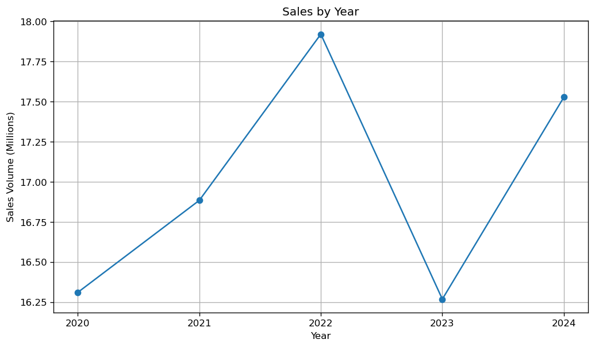
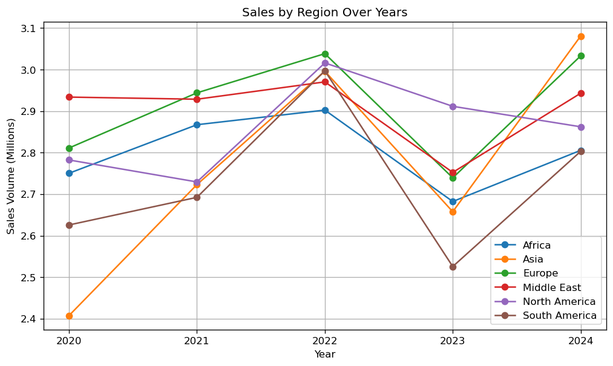
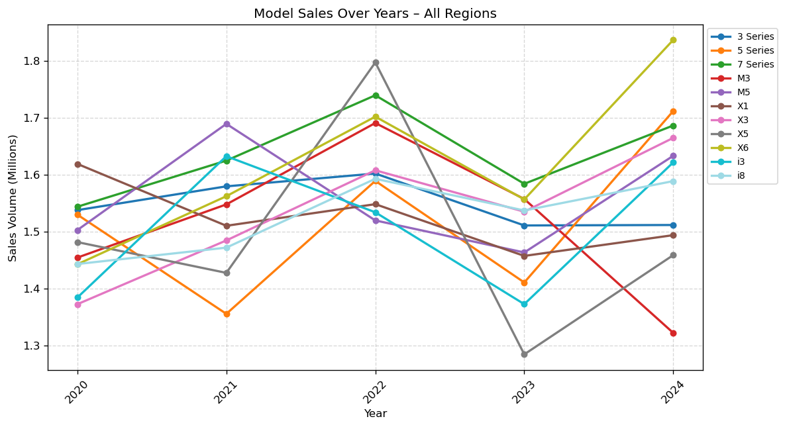
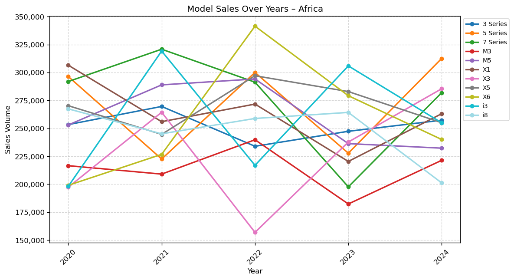
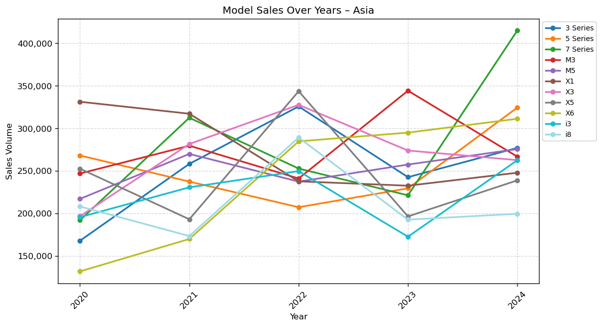
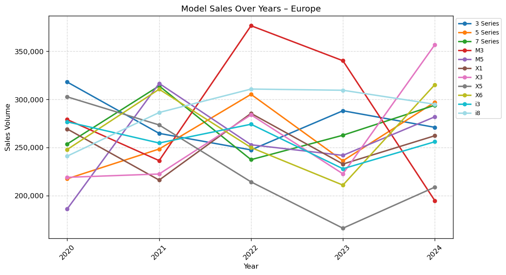
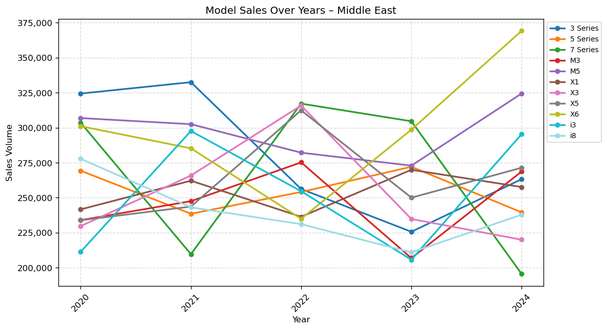
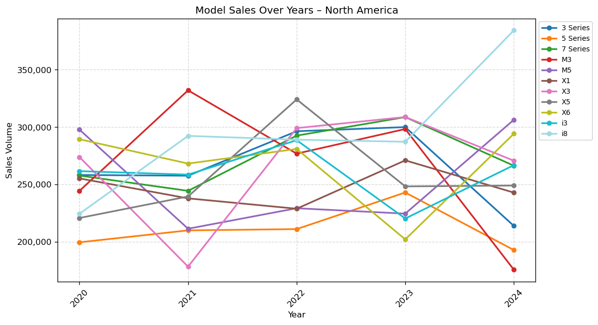
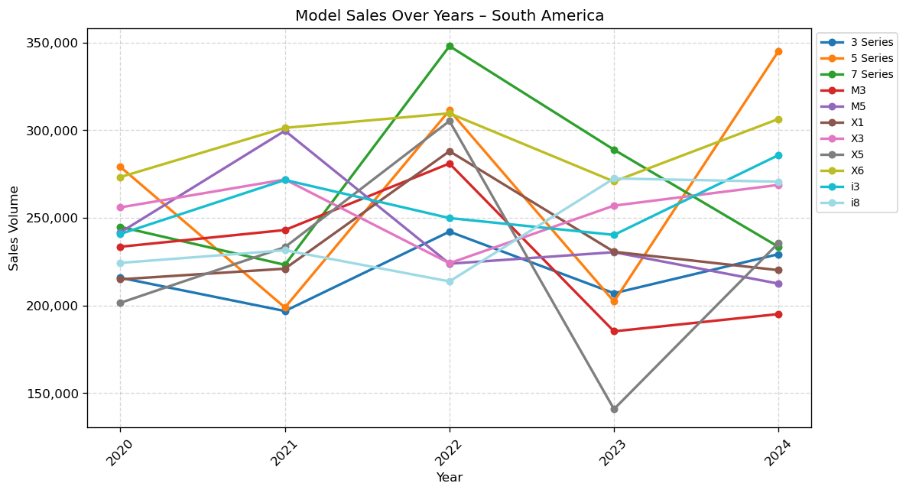
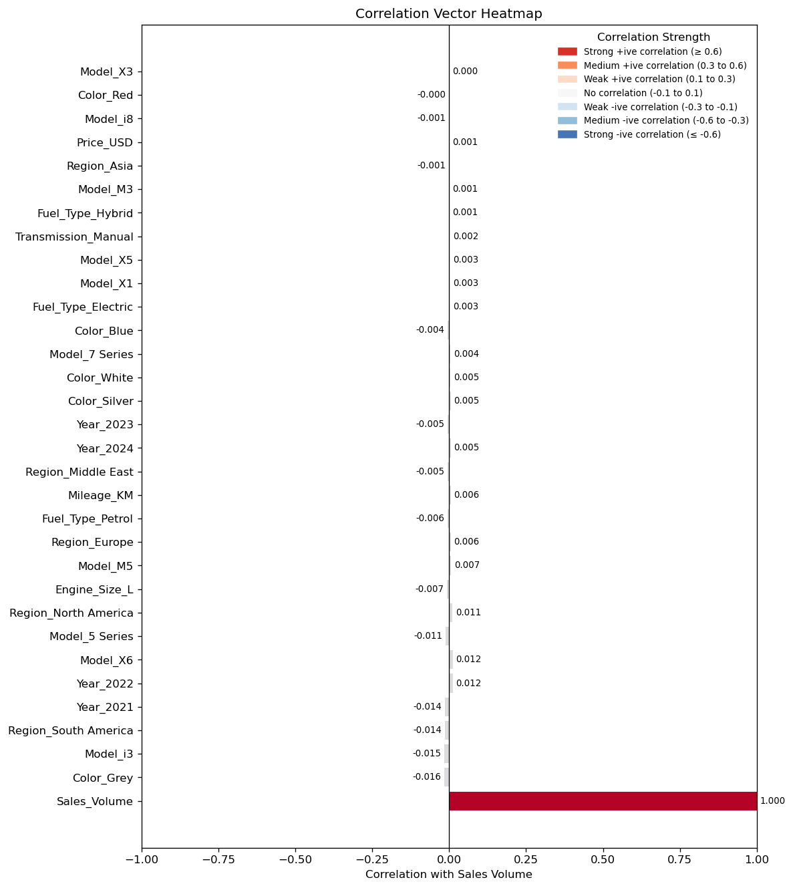

# BMW Sales Analysis Report

*Report generated on 2025-11-24 23:51:48*

# BMW Sales Performance Report (2020-2024)

## 1. Executive Summary

This report synthesizes key findings from BMW's sales performance between 2020 and 2024, covering overall and regional sales trends, model-specific performance, and the underlying drivers of sales.

*   **Sales Trend Analysis:**
    *   BMW experienced robust overall growth from 2020 to a peak in 2022 (17.92M units), followed by a notable dip in 2023 (16.27M units), and a strong recovery in 2024 (17.53M units).
    *   Regionally, Asia demonstrated the strongest consistent growth, achieving a new sales peak in 2024. Most regions mirrored the global trend, but North America showed a unique slight decline in 2024 against the general recovery. South America experienced the deepest proportional dip in 2023 but also a strong rebound.

*   **Model Performance Analysis:**
    *   The **BMW X6** emerged as a consistently high-growth, top-performing model, leading sales in 2024.
    *   Other strong performers include the **7 Series** (consistent flagship), **X3** (stable growth), and the **5 Series** (impressive rebound in 2024 after a significant dip).
    *   The **X1** showed a concerning decline from being the top seller in 2020. The **M3** experienced a sharp drop in 2024, and the **i3** faced volatility with a low point in 2023.
    *   Overall, the SUV segment (X-series) generally demonstrated strong market demand and growth.

*   **Key Drivers of Sales Analysis:**
    *   Correlation analysis (albeit showing weak relationships) indicates that strong sales performance in **2022**, the popularity of models like the **X6 and M5**, and robust markets in **North America and Europe** are positively associated with overall sales volume.
    *   Conversely, a decline in **Grey vehicle sales**, reduced demand for the **i3** and **5 Series** (despite its overall rebound, the correlation indicates underlying challenges), and challenges in the **South American** market are negatively associated with overall sales. Price alone showed a very weak correlation, suggesting other factors are more influential.

## 2. Analysis

### 1) Overall Sales Trend Analysis

Figure 1: BMW Total Sales Volume (2020-2024)

The overall BMW sales volume between 2020 and 2024 illustrates a dynamic market presence, with annual sales consistently in the multi-million range.
*   **Initial Growth (2020-2022):** The period commenced with total sales of 16.31 million units in 2020, rising steadily to 16.88 million in 2021, and peaking significantly at 17.92 million units in 2022. This phase underscores robust market expansion.
*   **Notable Dip (2023):** Following its peak, 2023 saw a substantial contraction, with sales falling to 16.27 million units, dropping below 2020 levels and indicating potential market headwinds.
*   **Strong Recovery (2024):** The most recent data for 2024 demonstrates a vigorous recovery, with sales rebounding to 17.53 million units. While not quite reaching the 2022 peak, this resurgence highlights BMW's adaptability and resilience post-downturn.

### 2) Regional Sales Trend Analysis

Figure 2: BMW Sales Volume by Region (2020-2024)

Regional sales trends reveal diverse performance patterns across BMW's global markets, generally characterized by a 2023 dip followed by a 2024 recovery, with some notable exceptions.
*   **Asia: The Growth Engine:**
    *   Asia consistently demonstrated the most impressive growth trajectory, escalating from 2.41 million units in 2020 to a new peak of 3.08 million in 2024, even after a dip in 2023. This region emerged as the highest-performing market in 2024.
*   **Europe: Stable & Resilient:**
    *   Europe maintained strong, consistent sales, peaking at 3.04 million in 2022 and recovering effectively to 3.03 million in 2024 after the 2023 dip, solidifying its role as a core stable market.
*   **Middle East & Africa: Mirroring Global Trends:**
    *   Both the Middle East and Africa largely mirrored the global pattern of a 2022 peak, 2023 dip, and 2024 recovery, returning close to their stable pre-dip levels.
*   **South America: Volatile but Resilient:**
    *   South America experienced the most significant proportional sales drop in 2023, falling to its lowest point, but subsequently demonstrated a robust recovery in 2024, indicating a dynamic and resilient market.
*   **North America: Unique 2024 Trend:**
    *   North America's trend diverged in 2024. After a strong peak in 2022 and a 2023 dip, its sales experienced another slight decrease in 2024 (2.86 million), contrasting with the recovery seen in most other regions and suggesting specific market challenges or shifts.

### 3) Overall Model Performance Analysis

Figure 3: BMW Model Sales Performance Across All Regions (2020-2024)

BMW's model sales performance from 2020-2024 reveals shifts in consumer preference, highlighting both successful and challenging product lines.

*   **Top-Performing Models and Growth:**
    *   The **BMW X6** showed exceptional growth, climbing steadily to become the absolute top performer in 2024 with 1.84 million units, demonstrating increasing market appeal for coupe-SUVs.
    *   The **BMW 7 Series** maintained its status as a consistently strong performer, often ranking among the top three.
    *   The **BMW X3** exhibited stable and commendable growth from 1.37 million in 2020 to 1.66 million in 2024, holding a strong mid-to-high ranking.
    *   The **BMW 5 Series** showcased remarkable resilience, rebounding significantly in 2024 to become the second-highest selling model (1.71 million units) after a major dip in 2021.
    *   The **BMW M5** consistently contributed strong sales, reflecting steady demand in the performance segment.

*   **Underperforming Models and Declines:**
    *   The **BMW X1**, despite being the top seller in 2020 (1.62 million units), experienced a consistent decline in both sales volume and ranking, falling to ninth position in 2024 (1.49 million units), indicating waning market interest or increased competition.
    *   The **BMW M3** saw a significant drop in 2023 and a sharp decline in 2024, becoming the lowest-performing model with 1.32 million units after peaking in 2022.
    *   The **BMW X5** exhibited significant volatility, being the top seller in 2022 (1.79 million units) but then dropping sharply in 2023, resulting in a net decrease in sales from 2020 to 2024.
    *   The **BMW i3** generally hovered at lower to mid-tier sales, reaching its lowest point in 2023 (1.37 million units), indicating challenges for this early electric vehicle offering, despite a resurgence in 2024.

*   **Notable Overall Trends:**
    *   The **SUV segment's strength** is evident with the rise of the X6, stable growth of the X3, and the X5's peak in 2022, collectively reinforcing strong market demand for BMW's X-series.
    *   **Sedan resilience** was highlighted by the 7 Series' consistent performance and the 5 Series' impressive rebound. The 3 Series remained a consistent, solid performer.
    *   **Volatility in performance models** (M-series) suggests sensitivity to market conditions or lifecycle changes.
    *   The **decline of the X1** from its leading position is a significant trend, possibly due to increased competition or evolving consumer preferences.

### 4) Regional Model Performance Analysis

This section delves into specific model performance within key global markets, highlighting regional nuances.

#### 4.1 Africa

Figure 4: BMW Model Sales Performance in Africa (2020-2024)

*   **Key Trends:** The i3 showed remarkable volatility, leading sales in 2021 and 2023. The X6 also experienced a significant surge in 2022.
*   **High-Performing Models:** The 5 Series closed the period strongly, leading sales in 2024. The X1, X5, X6, and 7 Series consistently featured among the top models, though with fluctuating performance.
*   **Underperforming Models:** The M3 consistently ranked among the lowest performers. The X3 experienced a notable decline in 2022 before a strong recovery in 2024.

#### 4.2 Asia

Figure 5: BMW Model Sales Performance in Asia (2020-2024)

*   **Key Trends:** The 7 Series exhibited a massive surge in 2024, becoming the dominant top performer, a significant shift from its mid-range performance in prior years.
*   **High-Performing Models:** The X1 was strong in earlier years, while the M3 led in 2023. The X3 and 3 Series also consistently performed well, with the X5 peaking in 2022.
*   **Underperforming Models:** The i8 consistently ranked among the lowest in sales, particularly declining from 2022 to 2024. The i3 also experienced a significant dip in 2023.

#### 4.3 Europe

Figure 6: BMW Model Sales Performance in Europe (2020-2024)

*   **Key Trends:** The M3 held a dominant lead in 2022 and 2023 before a sharp decline in 2024. The X3 made a strong comeback to lead sales in 2024.
*   **High-Performing Models:** The i8 showcased remarkably consistent strong performance throughout the period. The 3 Series, X6, and 7 Series also maintained strong positions.
*   **Underperforming Models:** The X5 experienced a concerning decline from 2021 onwards, becoming the lowest performer in 2023 and 2024. The M5 was consistently among the lower-performing models in the early and late years.

#### 4.4 Middle East

Figure 7: BMW Model Sales Performance in Middle East (2020-2024)

*   **Key Trends:** The region exhibited high volatility for top-selling models. The 7 Series dramatically surged to lead in 2022-2023 but sharply dropped to last place in 2024. Conversely, the X6 experienced a dominant year in 2024 after fluctuating performance.
*   **High-Performing Models:** The 3 Series showed consistent strong performance. The M5 and X6 frequently ranked among the top, especially in 2024. The i3 also showed dynamic growth from a low base.
*   **Underperforming Models:** The drastic decline of the 7 Series in 2024 is a significant underperformance. The M3 and i8 were frequently found in the lower half of sales rankings.

#### 4.5 North America

Figure 8: BMW Model Sales Performance in North America (2020-2024)

*   **Key Trends:** The i8 demonstrated a monumental surge in 2024, becoming the top seller after fluctuating performance in previous years. Models like the M3 peaked and then sharply declined.
*   **High-Performing Models:** The X3 showed good recovery and consistency after an initial dip. The X5, 7 Series, and M5 also had strong years.
*   **Underperforming Models:** The 5 Series consistently ranked low in sales throughout the period. The 3 Series and M3 saw significant declines in 2024 after earlier strong performances.

#### 4.6 South America

Figure 9: BMW Model Sales Performance in South America (2020-2024)

*   **Key Trends:** The X5 exhibited extreme volatility, being the lowest performer in 2020 and 2023 but very strong in 2022. The 7 Series dominated sales in 2022-2023 before a noticeable decline.
*   **High-Performing Models:** The 5 Series made an excellent comeback to lead sales in 2024. The X6 and X3 consistently performed well across the years. The i3 and i8 also showed strong performances in recent years.
*   **Underperforming Models:** The M3 consistently ranked among the lowest performers. The M5 also saw declines in sales in the later years of the period.

### 5) Key Drivers of Sales through Correlation Analysis

Figure 10: Correlation Vector for BMW Sales Drivers

An analysis of the correlation vector identifies potential drivers and inhibitors of BMW sales volume. It's important to note that all observed correlations are relatively weak, meaning no single feature demonstrates a strong linear relationship with sales volume in this dataset.

*   **Key Drivers (Strongest Positive Correlations - albeit weak):**
    *   **Year 2022 (0.0122):** Suggests 2022 was a year of relatively higher sales activity or a stronger baseline.
    *   **Model X6 (0.0116):** Indicates that a prominent presence of the X6 in the sales mix positively contributes to overall sales.
    *   **Region North America (0.0105):** Implies North America is a significant market whose strong performance generally contributes to higher global sales.
    *   **Model M5 (0.0065):** Points to a healthy demand for this performance model, contributing positively to overall sales.
    *   **Region Europe (0.0059):** Reinforces Europe's importance as a contributing market.

*   **Sales Inhibitors / Less Popular Options (Strongest Negative Correlations - albeit weak):**
    *   **Color Grey (-0.0158):** Suggests declining preference or lower sales contribution for vehicles in this color.
    *   **Model i3 (-0.0151):** May indicate a decline in its sales volume over time, possibly due to newer electric models or shifting preferences.
    *   **Region South America (-0.0142):** Suggests this region might be experiencing challenges or market contractions for BMW.
    *   **Year 2021 (-0.0135):** Implies sales volume in this year might have been relatively lower compared to others.
    *   **Model 5 Series (-0.0114):** Despite its overall strong rebound in 2024, this negative correlation suggests potential underlying challenges or a relative decline in its sales contribution when viewed across the entire period.

*   **Features with Weak or No Correlation:**
    *   **Price_USD (0.0009):** This critical observation indicates that within the analyzed range, vehicle price itself is not a strong standalone linear driver of sales volume.
    *   Many other features, including Model X3, specific fuel types (Electric, Hybrid), and Transmission_Manual, show minimal to no linear relationship with overall sales volume, implying their impact is either marginal or more complex.

## 3. Recommendations

Based on the analysis of sales trends, model performance, and key drivers, the following actionable recommendations are provided for business stakeholders:

*   **Recommendations for Sales Trends:**
    *   **Leverage Asia's Growth:** Capitalize on Asia's consistent growth and leading performance by increasing marketing investment, optimizing supply chains, and potentially introducing models tailored for this high-growth market.
    *   **Address North America's 2024 Dip:** Investigate the specific factors behind North America's unique decline in 2024, focusing on local market conditions, competitive pressures, or evolving consumer preferences, and develop targeted strategies for recovery.
    *   **Stabilize Volatile Markets:** For regions like South America that show deep dips and strong recoveries, implement flexible sales and marketing strategies that can quickly adapt to market volatility and maintain resilience.
    *   **Reinforce Core Markets:** Continue to support strong, stable markets like Europe and the Middle East with consistent product offerings and customer loyalty programs.

*   **Recommendations for Model Performance:**
    *   **Capitalize on X6 Success:** Further promote the X6, leveraging its strong market appeal and growth trajectory. Consider expanding its variants or emphasizing its unique styling in marketing campaigns.
    *   **Revitalize X1 and M3:** Investigate the reasons for the decline of the X1 (top seller in 2020) and the sharp drop of the M3 in 2024. This may involve product updates, competitive analysis, or repositioning to regain market share.
    *   **Sustain 5 Series Rebound:** Analyze the drivers behind the 5 Series' impressive 2024 rebound to replicate success and ensure sustained performance, perhaps through continued product enhancements or strategic marketing.
    *   **Re-evaluate i3 Strategy:** Given the i3's volatility and negative correlation, assess its long-term viability or consider transitioning focus to newer, more advanced electric models that better meet current market demands.
    *   **Monitor SUV Segment:** Continue to prioritize and innovate within the X-series SUV lineup, as this segment consistently demonstrates strong market demand and growth.

*   **Recommendations for Key Drivers of Sales:**
    *   **Strategic Regional Focus:** Prioritize marketing and sales efforts in key contributing regions like North America and Europe, which show positive correlation with overall sales.
    *   **Model-Specific Promotion:** Continue to promote models like the X6 and M5 that demonstrate a positive, albeit weak, correlation with overall sales, recognizing their contribution to the sales mix.
    *   **Address Color Preferences:** Investigate the negative correlation with Grey-colored vehicles. This could inform inventory management, color palette offerings, or marketing efforts to understand and influence consumer color choices.
    *   **Understand Price Impact:** Acknowledge the weak correlation of price with overall sales, suggesting that BMW's brand strength, features, and model appeal are more significant drivers for its target market. Continue to focus on value proposition rather than relying on price adjustments as a primary sales lever.